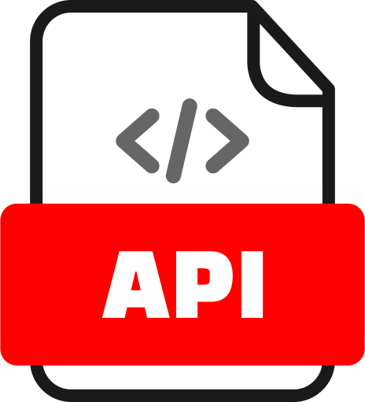

# Hi 👋 Welcome! My name is Andrea Freud.

I started this project to become a backend developer — not just by watching tutorials, but by building real systems and solving practical problems.
The tasks are becoming progressively more challenging, focusing on server-side logic, databases, and API development.
By the end of this journey, my goal is to confidently design, build, and launch robust backend applications.

 <a href="https://github.com/Nagraggini/Nagraggini/blob/main/Andrea_Freud_CV.pdf"> View My CV </a>

 <a href="https://nagraggini.github.io/Project-showcase/index.html"> View my Web Projects</a>

<a href="https://nagraggini.github.io/Web-practising-and-fun/Web_Development/Practising/1-HTML%20Practising/2-Blog.html"> My IT Blog (only Hungarian yet)</a>

## 📜 Github stats:

<!---->

<!--Profile visitors:-->
<!-- -->

 

## 💻 Technologies & Tools:

### Frontend

  
  
     

### Backend

  
  
  

### Tools

  
  

## Skills

**Java**  
🟥🟥🟥🟥🟥⬜⬜⬜⬜⬜ 50%

**HTML**  
🟩🟩🟩🟩🟩🟩🟩🟩⬜⬜ 75%

**CSS**  
🟦🟦🟦🟦🟦🟦🟦⬜⬜⬜ 65%

**JavaScript**  
🟧🟧🟧🟧🟧🟧⬜⬜⬜⬜ 55%

I am listed among the most active GitHub users in Hungary:  
[List](https://github.com/gayanvoice/top-github-users/blob/main/markdown/total_contributions/hungary.md)
